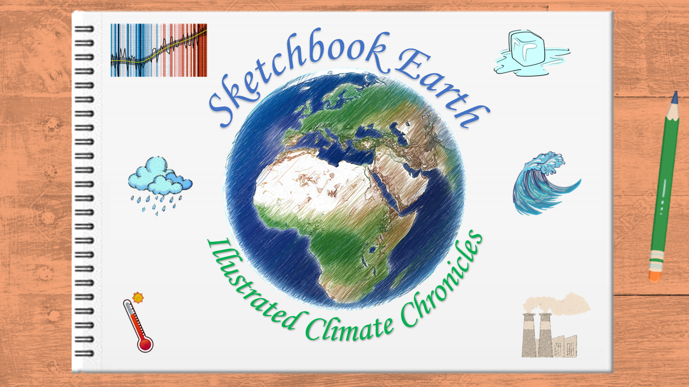

# Sketchbook Earth: Illustrated Climate Chronicles


Sketchbook Earth is a project aiming to illustrate the production of [Climate Intelligence Reports](https://climate.copernicus.eu/climate-intelligence), 
traditionally done with the ECMWF's in-house developed tools. In this project we developed a series of Jupyter notebooks that will illustrate our planet's climate stories in an accessible and engaging manner.

Leveraging open-access software and specialized libraries, these notebooks will retrieve and process data from the Copernicus Climate Data Store (CDS), 
and other sources, transforming raw information into expressive visual narratives. We will focus on downloading and preprocessing Essential Climate 
Variables (ECVs), calculating climate anomalies, and generating visualizations that echo the vibrant storytelling found in a sketchbook. 

The resulting Jupyter notebooks will not only provide meaningful climate insights but also serve as a comprehensive training resource. 
Through Sketchbook Earth, we aim to offer a more visual, comprehensible, and reproducible approach to climate intelligence.

This project was part of the [Code for Climate 2023](https://codeforearth.ecmwf.int/).


### Contents
Please browse through the tutorials listed below, or make use of the search function to look for specific topics or data processing workflows of interest.

```{tableofcontents}
```